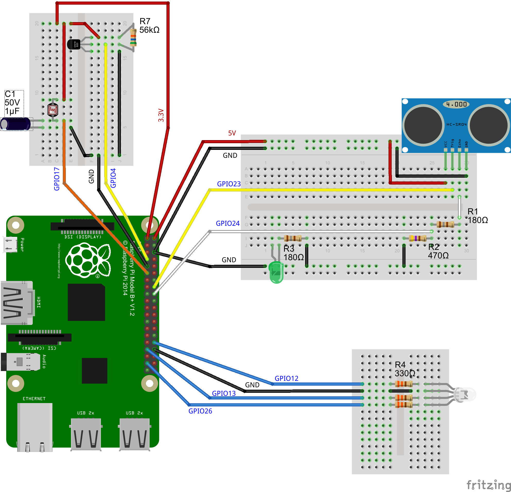

GaragePi
========

Using a Raspberry Pi mounted in my garage, I check if the garage door has been left open, the light has been left on, the temperature and other things.  This repo is the source that goes along with that project.

#For details, see the following blog posts:

* [GaragePi – My Raspberry Pi Playground](http://www.wrightfully.com/garagepi-my-raspberry-pi-playground/)
* [GaragePi v2: Temperature and Light](http://www.wrightfully.com/garagepi-v2-temperature-and-light/)
* [GaragePi v3: Data Persistence and Visualization and Other Small Improvements](http://www.wrightfully.com/garagepi-v3-data-persistence-and-visualization-and-other-small-improvements/)

# The circuit diagram that goes along with the code:

